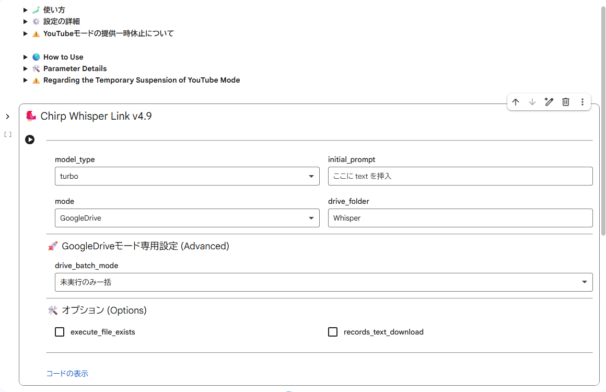

# 🐦 Chirp Whisper Link v4.5  

  

YouTube URLやローカルファイルから、Whisperを使って自動で文字起こしするシンプルなColabスクリプトです  
A simple Google Colab script to transcribe audio from YouTube URLs or local files using Whisper.  

⭐ [スター](https://github.com/neon-aiart/chirp-whisper-link/)をポチッとお願いします✨ (Please hit the [Star] button!)

   

---

## ✨ 特徴 / Features  
- **デュアルモード:** YouTube URLとローカルファイルの両方に対応  
  **Dual Mode:** Support for both YouTube URLs and local file uploads.  
- **自動ダウンロード:** 文字起こし結果を自動的に.txt形式で保存・ダウンロード  
  **Auto-Download:** Automatically saves the transcription as a `.txt` file to your computer.  
- **スマートロード:** モデルがロード済みかを自動判定し、待ち時間を短縮  
  **Smart Loading:** Detects if the model is already loaded to save time.  
- **完了通知音:** 処理が終わると「きらめき音」でお知らせ  
  **Notification Sound:** Plays a "sparkle" sound when the task is complete.  

---

## 🚀 使い方 / How to Use  
下のボタンを押してGoogle Colabで実行してください  
Click the button below to open the script in Google Colab and start transcribing!  

 
  

1. **ランタイムのタイプを変更 / Change Runtime Type**  
  上部メニューの「ランタイム」→「ランタイムのタイプを変更」からハードウェアを選択します  
  (Go to "Runtime" -> "Change runtime type" in the top menu.)  
   * **T4 GPU**: < おすすめ > 高速に処理できます (Recommended for high-speed processing.)  
   * **CPU**: 時間がかかってもいい場合や、GPU枠を節約したい時 (Use this to save GPU quota if you don't mind it taking longer.)  

2. **ランタイムに接続 / Connect to Runtime**  
  右上の「接続」をクリックして準備します (Click "Connect" in the top right corner.)  

3. **モードの選択 / Select Mode**  
  **mode** を設定しますYouTubeなら `YouTube`、パソコン内のファイルなら `Upload` を選択  
(Set the **mode**: select `YouTube` for URLs or `Upload` for local files.)  

4. **URLの入力 (YouTubeモードの場合) / Enter URL (for YouTube Mode)**  
  **youtube_url** にURLを入力します (Enter the URL in the **youtube_url** field.)  

5. **再生ボタンを押して実行 / Click the Play Button**  
  セルの左側にある再生ボタンをクリックして実行します (Click the Play button on the left side of the cell to start.)  

6. **ファイルのアップロード (Uploadモードの場合) / Upload File (for Upload Mode)**  
  途中で「ファイル選択」ボタンが表示されるので、ファイルを選択してください  
  (When the "Choose Files" button appears, select your audio file.)  

7. **続けて実行する場合 / To Continue**  
  手順3に戻り、設定を変更して再度再生ボタンを押します  
  (Go back to step 3, change settings, and click the Play button again.)  

8. **終わったら接続解除 (ゼッタイ！) / Disconnect (Crucial!)**  
  **「ランタイムを接続解除して削除」** を必ず行ってください  
  (Always select **"Disconnect and delete runtime"** when finished.)  

<b>📸 スクリーンショット / Interface Screenshot</b>

  

  

---

### ⚙️ 設定の詳細 / Parameter Details  

* **model_type**:  
  * `turbo`: 早くしてほしい時に (When you want it fast)  
  * `large-v3`: ガンバってほしい時に (When you want the best accuracy)  

* **initial_prompt**:  
  どんな内容か書くと、専門用語などの誤字が減りやすくなります  
  (Helps the AI recognize technical terms and specific context to improve accuracy.)  

* **mode**:  
  `Upload`: パソコン内の音声・動画ファイルを読み込む (Process local files)  
    &emsp;※ `youtube_url`は無視されます (`youtube_url` is ignored)  
  `YouTube`: 動画のURLから音声を抽出 (Extract audio from URL)  
    &emsp;※ `execute_file_exists`は無視されます (`execute_file_exists` is ignored)  

* **youtube_url**:  
  YouTubeの動画リンク (YouTube video link)  
    &emsp;※ `mode`が`Upload`のときは無視されます (`mode: Upload` ignores this)  

* **execute_file_exists**:  
  * **ON**: フォルダ内に以前のファイルが残っている場合、**アップロードをスキップして最新のファイルを再利用**します (Reuses the latest file in the folder, **skipping the upload/download process**.)  
  * **OFF**: ローカルファイルをアップロード、または、YouTubeから動画をダウンロードします (Uploads a local file or downloads from YouTube.)  

  &emsp;※ `mode`が`YouTube`のときは無視されます (`mode: YouTube` ignores this)  

* **records_text_download**:  
  議事録もダウンロード (Toggle to download timestamped transcript (.txt))  

### 🚀 効率化機能：既存ファイルの再利用 / Optimization: Reusing Existing Files  

アップロード・ダウンロード済みの最新ファイルを再利用することで、パラメータ調整時の待ち時間を大幅に短縮できます  
Reuse the most recently uploaded or downloaded file to significantly reduce wait times during parameter tuning.  

#### 1. `mode`を`Upload`にする (switching `mode` to `Upload`)  
  * **通常(Standard)**: `YouTube Download (60s)` + `Whisper (120s)` = **180sec**  
  * **再利用モード(Reuse)**: `Whisper (120s)` only = **120秒（33% OFF!）**  

#### 2. YouTube動画の「キャッシュ」利用テクニック / YouTube "Cache" Technique  
長尺のYouTube動画で、Whisperのパラメータ（PromptやVAD設定など）を何度も試したい場合に有効です  
Useful when testing Whisper parameters (Prompt, VAD settings, etc.) for long YouTube videos.  

  1. 最初は `mode: YouTube` で実行し、動画をダウンロード・文字起こしします  
     **Initial Run**: Set `mode: YouTube` to download and transcribe the video. 
  2. 2回目以降は、以下のように設定して実行します  
     **Subsequent Runs**: Configure the following settings:  
    * **`mode`**: `Upload` に切り替え (Switch to `Upload`)  
    * **`execute_file_exists`**: **ON** にする (**ON**)  
  3. YouTubeからの再ダウンロードをスキップし、ローカルに保存された音声ファイルを直接読み込みます  
     **Result**: Skips re-downloading and reads the locally saved audio file directly.  

> [!TIP]  
> YouTubeのダウンロードは音声抽出や変換に数十秒〜数分かかる場合があります  
> この「キャッシュ利用」により、その待ち時間をゼロにできます  
> YouTube downloads can take anywhere from tens of seconds to several minutes for audio extraction and conversion.  
> This "Cache" technique reduces that wait time to zero.  

---

## ⚠️ 注意事項 / Important  
ファイルがダウンロードされたら、必ず手動で **「ランタイムを接続解除」** してください  
接続したまま放置すると、無料枠のGPU時間がすぐになくなってしまいます  
**Please remember to "Disconnect and delete runtime" manually after use.**  
Leaving it connected will exhaust your remaining GPU time.  

---

## 📝 更新履歴 (Changelog)  

### [v4.5](https://colab.research.google.com/github/neon-aiart/chirp-whisper-link/blob/main/chirp-whisper-link%20v4.5.ipynb) (Current Release)  
✅ 再利用可能に (execute_file_existsを追加)  
☑️ languageをNoneに変更 (自動判定に任せる)  

### v4.4 (UnReleased)  
✅ 精度を改善  
☑️ condition_on_previous_textを削除 (trueで固定)  

### v4.3  
✅ Faster-Whisperに変更  
✅ 議事録のダウンロードをON/OFFに変更  

### v4.2  
✅ txtを議事録に変更  
✅ ダウンロードするファイルにsrtを追加  
☑️ 軽微な修正  

### v4.1  
✅ 初リリース  

---

## 🛡️ ライセンスについて (License)  

このユーザースクリプトのソースコードは、ねおんが著作権を保有しています  
The source code for this application is copyrighted by Neon.  

* **ライセンス / License**: **[PolyForm Noncommercial 1.0.0](https://polyformproject.org/licenses/noncommercial/1.0.0/)** です（LICENSEファイルをご参照ください）  
  Licensed under PolyForm Noncommercial 1.0.0. (Please refer to the LICENSE file for details.)  
* **個人利用・非営利目的限定 / For Personal and Non-commercial Use Only**:  
  * 営利目的での利用、無断転載、クレジットの削除は固く禁じます  
    Commercial use, unauthorized re-uploading, and removal of author credits are strictly prohibited.  
* **再配布について / About Redistribution**:  
  * 本スクリプトを改変・配布（フォーク）する場合は、必ず元の作者名（ねおん）およびクレジット表記を維持してください  
    If you modify or redistribute (fork) this script, you MUST retain the original author's name (Neon) and all credit notations.  

※ ご利用は自己責任でお願いします（悪用できるようなものではないですが、念のため！）  

---

## ⚠️ セキュリティ警告 / Security Warning  

🚨 **重要：公式配布について / IMPORTANT: Official Distribution**  
当プロジェクトの公式スクリプトは、**GitHub または GreasyFork** でのみ公開しています。  
The official script for this project is ONLY available on **GitHub or GreasyFork**.  

🚨 **偽物に注意 / Beware of Fakes**  
他サイト等で `.zip`, `.exe`, `.cmd` 形式で配布されているものはすべて**偽物**です。  
これらには**ウイルスやマルウェア**が含まれていることが確認されており、非常に危険です。  
Any distribution in `.zip`, `.exe`, `.cmd` formats on other sites is **FAKE**.  
These have been confirmed to contain **VIRUSES or MALWARE**.  

### ⚖️ 法的措置と通報について / Legal Action & Abuse Reports  
当プロジェクトの制作物に対する無断転載が確認されたため、過去に **DMCA Take-down通知** を送付しています。  
また、マルウェアを配布する悪質なサイトについては、順次 **各機関へ通報 (Malware / Abuse Report)** を行っています。  
We have filed **DMCA Take-down notices** against unauthorized re-uploads of my projects.  
Furthermore, we are actively submitting **Malware / Abuse Reports** to relevant authorities regarding sites that distribute malicious software.  

---

## 開発者 (Author)  

**ねおん (Neon)**  
<pre>
 Bluesky       :<a href="https://bsky.app/profile/neon-ai.art/">https://bsky.app/profile/neon-ai.art/</a>
 GitHub        :<a href="https://github.com/neon-aiart/">https://github.com/neon-aiart/</a>
 GitHub Pages  :<a href="https://neon-aiart.github.io/">https://neon-aiart.github.io/</a>
 Greasy Fork   :<a href="https://greasyfork.org/ja/users/1494762/">https://greasyfork.org/ja/users/1494762/</a>
 Sizu Diary    :<a href="https://sizu.me/neon_aiart/">https://sizu.me/neon_aiart/</a>
 Ofuse         :<a href="https://ofuse.me/neon/">https://ofuse.me/neon/</a>
 chichi-pui    :<a href="https://www.chichi-pui.com/users/neon/">https://www.chichi-pui.com/users/neon/</a>
 iromirai      :<a href="https://iromirai.jp/creators/neon/">https://iromirai.jp/creators/neon/</a>
 DaysAI        :<a href="https://www.days-ai.com/users/lxeJbaVeYBCUx11QXOee/">https://www.days-ai.com/users/lxeJbaVeYBCUx11QXOee/</a>
</pre>

---
