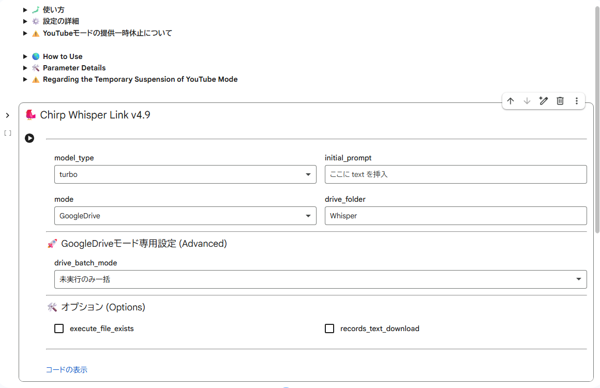

# 🐦 Chirp Whisper Link v4.9  

  

**AI×AIのハイブリッド文字起こしの決定版！** WhisperとGeminiを使って、専門用語も逃さず全自動で文字起こしする究極のColabノートブック  

The Ultimate **AI-to-AI Hybrid Transcription** Tool! A master-class Colab notebook for fully automated transcription that captures every technical term using Whisper and Gemini.  

⭐ [スター](https://github.com/neon-aiart/chirp-whisper-link/)をポチッとお願いします✨ (Please hit the [Star] button!)  

   

---

## ✨ 主な特徴 / Features  

### 🇯🇵

* **🔗 ハイブリッド・AI・ワークフロー**  
  文字起こし前に **Gemini 3 Flash** が音声を「下読み」し、固有名詞や専門用語を自動抽出  
  Whisperの性能を最大限に引き出し、固有名詞の誤変換を劇的に改善します  

* **🚀 爆速 Google Drive 連携**  
  Colabへの高速ロード＆未実行ファイルのみを自動抽出して一括処理  
  事前のアップロードが可能作業で、読み込み時間を大幅短縮  

* **🌍 ローカライズ自動最適化**  
  ブラウザの言語を読み取り、最適なモデル（**Kotoba-Whisper** / **turbo**）を自動選択  
  タイムゾーンも環境に合わせて「JST / UTC」を適切に切り替えます  

* **🔄 スマート・リロード**  
  メモリ上のロード済みのライブラリとモデルを自動検知  
  変更がない限りロードをスキップし、作業再開を爆速にします  

* **🐤 完了を告げる「Chirp」サウンド**  
  処理が終わると、小鳥のさえずりのような通知音でお知らせ  
  バックグラウンドで処理をしていても、作業完了を軽やかにキャッチできます  

### 🇺🇸

* **🔗 Hybrid AI Workflow**  
  **Gemini 3 Flash** "pre-reads" the audio to extract proper nouns and technical terms before transcription.  
  This maximizes Whisper's performance and drastically improves the accuracy of proper noun conversion.  
* **🚀 High-Speed Google Drive Integration**  
  Features fast loading into Colab and automatic batch processing of unprocessed files.  
  Pre-uploading files significantly reduces manual work and processing time.  
* **🌍 Intelligent Localization**  
  Automatically detects browser language to select the optimal model (**Kotoba-Whisper** or **turbo**).  
  Time zones are also adjusted between "JST" and "UTC" based on your environment.  
* **🔄 Smart Reloading**  
  Automatically detects already-loaded libraries and models in memory.  
  Skips redundant loading processes for lightning-fast task resumption.  
* **🐤 "Chirp" Completion Sound**  
  A cheerful bird-like notification sound alerts you when processing is complete.  
  Easily catch the end of a task even while working in the background.  

---

## 📖 使い方 / How to Use  

下のボタンを押してGoogle Colabで実行してください  
Click the button below to open the script in Google Colab and start transcribing!  

  

### 🇯🇵

1. ⚙️ **ランタイムのタイプを変更**  
  上部メニューの「ランタイム」→「ランタイムのタイプを変更」からハードウェアを選択します  
   * **T4 GPU**: < おすすめ > 高速に処理できます  
   * **CPU**: 時間がかかってもいい場合や、GPU枠を節約したい時  

2. 🔌 **ランタイムに接続**  
  右上の「接続」をクリックして準備します  

3. 📑 **モードの選択**  
  **mode** を設定します: パソコン内のファイルなら `Upload` 、GoogleDriveなら `GoogleDrive`を選択  

4. 📂 **フォルダー名を入力 (GoogleDriveモード)**  
  **drive_folder** にフォルダー名を入力します (初期値: `/Whisper/`)  

5. ▶️ **再生ボタンを押して実行**  
  セルの左側にある再生ボタンをクリックして実行します  

6. 📤 **ファイルのアップロード (Uploadモードの場合)**  
  途中で「ファイル選択」ボタンが表示されるので、ファイルを選択してください  

7. 🔄 **続けて実行する場合**  
  手順3に戻り、設定を変更して再度再生ボタンを押します  

8. ⚠️ **終わったら接続解除 (ゼッタイ！)**  
  **「ランタイムを接続解除して削除」** を必ず行ってください  

### 🇺🇸  

1. ⚙️ **Change Runtime Type**  
   Go to "Runtime" -> "Change runtime type" in the top menu and select your hardware.  
   * **T4 GPU**: < Recommended > For high-speed processing.  
   * **CPU**: If you don't mind it taking longer or want to save your GPU quota.  
2. 🔌 **Connect to Runtime**  
   Click "Connect" in the top right corner to prepare the environment.  
3. 📑 **Select Mode**  
   Set the **mode**: Select `Upload` for local files or `GoogleDrive` for Google Drive.  
4. 📂 **Enter Folder Name (for GoogleDrive Mode)**  
   Enter your target folder name in the **drive_folder** field. (default: `/Whisper/`)  
5. ▶️ **Click the Play Button**  
   Click the play button on the left side of the cell to start the process.  
6. 📤 **Upload File (for Upload Mode)**  
   When the "Choose Files" button appears during execution, select your audio file.  
7. 🔄 **To Continue**  
   Go back to step 3, adjust settings, and click the play button again.  
8. ⚠️ **Disconnect (Crucial!)**  
   Always select **"Disconnect and delete runtime"** from the menu when finished.  

---

<b>📸 スクリーンショット / Interface Screenshot</b>

  

  

---

## 🔑 Gemini API キーの設定 / API Key Setup  

Gemini 3 Flash による「下読み」機能を有効にするために設定が必要です  
Setup is required to enable the "Pre-reading" feature using Gemini 3 Flash.  

### 🇯🇵  

1. **APIキーを取得**: [Google AI Studio](https://aistudio.google.com/app/apikey) でキーを作成します  
2. **Colabに登録**: 画面左側の **鍵アイコン（シークレット）** をクリック  
3. **追加**: 名前を `GEMINI_API_KEY` とし、値を貼り付けます  
4. **許可**: 「ノートブックからのアクセス」のチェックを **ON** にしてください  

> [!TIP]  
> APIキーがなくても動作します  
> キーが設定されていない場合、Geminiによる抽出プロセスのみがスキップされ、通常のWhisper文字起こしとして動作します  

### 🇺🇸  

1. **Get API Key**: Create your key at [Google AI Studio](https://aistudio.google.com/app/apikey).  
2. **Register in Colab**: Click the **Key icon (Secrets)** on the left sidebar.  
3. **Add Secret**: Set the Name to `GEMINI_API_KEY` and paste your key into the Value.  
4. **Grant Access**: Toggle the "Notebook access" switch to **ON**.  

> [!TIP]  
> Works without an API Key  
> If no key is set, the Gemini extraction process is skipped, and the tool functions as a standard Whisper transcription.  

---

### ⚠️ 無料枠での利用に関する注意 / Precautions (Free Tier)  

#### 🇯🇵  

* **データの取り扱い**: 無料枠（Free Tier）でファイルをアップロードして解析する場合、**入力データが Google のモデル改善（学習）に利用される可能性**があります  
* **機密情報の扱い**: 機密性の高い音声ファイルを扱う場合は、有料枠（Pay-as-you-go）への切り替え、またはAPIキーを設定せずに実行することを検討してください  

#### 🇺🇸  

* **Data Privacy**: When using the Free Tier, **your input data may be used by Google to improve their models (training)**.  
* **Sensitive Information**: For highly confidential audio, consider switching to the Pay-as-you-go tier or running the tool without an API key.  

---

## 🛠️ 各モードの詳細 / Mode Details  

### 📥 Upload Mode  

#### 🇯🇵  

* **手軽な実行**: 実行中に表示されるボタンからファイルを選択するだけ  
* **再利用機能**: `execute_file_exists` にチェックを入れると、最後にアップロードしたファイルを再利用できます（パラメータを調整して試したい時に便利！）  
* **自動ダウンロード**: 完了後、結果ファイル（`.srt` / `.log`）がブラウザから自動でダウンロードされます  

#### 🇺🇸  

* **Easy Execution**: Simply select your file using the button that appears during execution.  
* **Reuse Feature**: Checking `execute_file_exists` allows you to reuse the last uploaded file (useful for fine-tuning parameters!).  
* **Auto-Download**: Result files (`.srt` / `.log`) are automatically downloaded to your browser upon completion.  

### ☁️ GoogleDrive Mode  

#### 🇯🇵  

* **事前準備**: 実行前に、処理したいファイルを Drive 内の指定フォルダ（初期値: `/Whisper/`）に入れておいてください  
* **自動保存**: 生成されたファイルは、音源と同じ Drive フォルダ内に直接保存されます  
* **一括処理**: フォルダ内の未実行ファイルのみを賢く選別して、まとめて文字起こしします  

#### 🇺🇸  

* **Preparation**: Before running, place your audio files in the designated Drive folder (default: `/Whisper/`).  
* **Auto-Save**: Generated files are saved directly in the same Drive folder as the source audio.  
* **Batch Processing**: Smartly identifies and processes only the files that haven't been transcribed yet.  

---

## 📄 出力ファイル / Outputs  

### 🇯🇵  

* **字幕ファイル (`.srt`)**: 動画編集や再生プレイヤーでそのまま使える標準形式（常に生成）  
* **議事録ログ (`.log`)**: タイムスタンプが記録された、内容確認に最適なテキスト（オプション）  
* **プレーンテキスト (`.txt`)**: タイムスタンプなしの純粋な本文テキスト（隠しオプション）  

### 🇺🇸  

* **Subtitle File (`.srt`)**: Standard format for video editing and players (always generated).  
* **Transcription Log (`.log`)**: Text with timestamps, ideal for reviewing content (optional).  
* **Plain Text (`.txt`)**: Pure transcript without timestamps (hidden option).  

---

## ⚙️ 設定の詳細 / Parameter Details  

### 💫 モデルとプロンプト (Model & Prompt)  

#### 🇯🇵  

* **`model_type`**  
  * **`auto`**: ブラウザ言語を判定し、日本語なら `Kotoba-Whisper`、英語なら `turbo` を自動選択  
  * **`turbo`**: 早くしてほしい時に  
  * **`large-v3`**: ガンバってほしい時に  
  * **`Kotoba-Whisper`**: `turbo`をベースにした高速・軽量な日本語特化モデル  
  * **`Distil-Whisper`**: `large-v3` をベースにした推論速度向上版  

* **`initial_prompt`**  
  特定の固有名詞や専門用語の認識、句読点、漢字の変換ミスを防ぐために事前に伝えるヒント  
  * **空欄の場合**: **Gemini 3 Flash** が音声を下読みし、最適なプロンプトを自動生成（APIキーが必要）  

#### 🇺🇸  

* **`model_type`**  
  * **`auto`**: Detects browser language. Selects `Kotoba-Whisper` for Japanese and `turbo` for English.  
  * **`turbo`**: Use when you want it fast.  
  * **`large-v3`**: Use when you want the best possible accuracy.  
  * **`Kotoba-Whisper`**: High-speed, lightweight model optimized for Japanese.  
  * **`Distil-Whisper`**: A distilled version of `large-v3` with faster inference speed.  
* **`initial_prompt`**  
  A prompt provided in advance to improve recognition of proper nouns, technical terms, and punctuation.  
  * **If empty**: **Gemini 3 Flash** analyzes the audio and automatically generates the optimal prompt (Requires API key).  

### 🔄 動作モード (Mode)  

#### 🇯🇵  

* **`mode`**:  
  * `Upload`: パソコン内のファイルを読み込む（手軽な単発処理）  
  * `GoogleDrive`: 指定フォルダからファイルを読み込む（大量・一括処理）  
  * `YouTube`: (棚上げ)
* **`drive_folder`**:  
  * Google Drive内の対象フォルダ名（初期値: `Whisper`）  
* **`execute_file_exists`** (Uploadモード専用)  
  * **ON**: アップロード済みの最新ファイルを再利用します  
  * **OFF**: 常に新しいファイルをアップロードします  

#### 🇺🇸  

* **`mode`**:  
  * `Upload`: Process files from your computer (Single task).  
  * `GoogleDrive`: Process files from a specific folder (Bulk/Batch task).  
  * `YouTube`: (shelved)  
* **`drive_folder`**: The target folder name in Google Drive (Default: `Whisper`).  
* **`execute_file_exists`** (Upload mode only):  
  * **ON**: Reuses the most recently uploaded file.  
  * **OFF**: Always prompts for a new file upload.  

### 📄 出力オプション (Outputs Options)  

#### 🇯🇵  

* **`records_text_download`**: タイムスタンプ付きの議事録（.log）を保存します  
* **`drive_batch_mode`** (GoogleDriveモード専用):  
  * `未実行のみ一括処理`: まだ `.srt` が生成されていないファイルだけを探して実行します  
  * `最新の１件のみ`: フォルダ内の最新ファイル１つだけを処理します  
* **`plain_text_download`** (隠しオプション): タイムスタンプなしの純粋なテキスト本文（`.txt`）を保存します  

#### 🇺🇸  

* **`records_text_download`**: Saves a transcription log with timestamps (`.log`).  
* **`drive_batch_mode`** (GoogleDrive mode only):  
  * `Unprocessed Only`: Searches for and processes only files without `.srt`.  
  * `Latest Only`: Processes only the single newest file in the folder.  
* **`plain_text_download`** (Internal option): Saves the raw text body without timestamps (`.txt`).  

---

### 🚀 効率化機能：既存ファイルの再利用 / Optimization: Reusing Existing Files  

アップロード・ダウンロード済みの最新ファイルを再利用することで、パラメータ調整時の待ち時間を大幅に短縮できます  
Reuse the most recently uploaded or downloaded file to significantly reduce wait times during parameter tuning.  

#### `mode`を`Upload`にする (switching `mode` to `Upload`)  

* **通常(Standard)**: $\text{File Upload (60s)} + \text{Whisper (120s)} = 180\text{s}$  
* **再利用モード(Reuse)**: $\text{Whisper (120s)}$ only = **120s (33% OFF!)**  

---

## ⚠️ YouTubeモードの提供一時休止について  

現在、YouTube側のセキュリティ強化（Bot検知やPO Tokenの導入）により、外部ツールからの直接ダウンロードが非常に不安定になっています  

ユーザーの皆様のアカウントの安全を第一に考え、本ツールでは**YouTube URLによる直接指定機能を一時停止（Shelved）** しています  

現在は以下の２つのモードが利用可能です：  

- **Uploadモード**: ローカルにあるファイルを直接アップロード  
- **GoogleDriveモード**: GoogleDrive内の指定フォルダ（デフォルトは `Whisper`）にあるファイルを利用  

YouTubeの音声を文字起こししたい場合は、あらかじめご自身で音声ファイルを準備し、上記いずれかのモードでご利用ください  

## ⚠️ Regarding the Temporary Suspension of YouTube Mode  

Due to enhanced YouTube security measures (Bot detection, PO Tokens, etc.), direct downloads via external tools are currently unstable.  

To ensure account safety, the **YouTube URL input functionality is currently suspended (Shelved)**.  

We recommend using one of the following modes:  

- **Upload Mode**: Upload audio files directly from your local machine.  
- **GoogleDrive Mode**: Use files stored in a specific GoogleDrive folder (default: `Whisper`).  

If you wish to transcribe YouTube content, please prepare the audio file in advance and use the "Upload" or "GoogleDrive" mode.  

---

## ⚠️ 注意事項 / Important  

ファイルがダウンロードされたら、必ず手動で **「ランタイムを接続解除」** してください  
接続したまま放置すると、無料枠のGPU時間がすぐになくなってしまいます  

Please remember to **"Disconnect and delete runtime"** manually after use.  
Leaving it connected will exhaust your remaining GPU time.  

---

## 📝 更新履歴 (Changelog)  

### v4.9 (Current Release)  

✅ initial_promptが空欄の場合はGeminiで自動補完  
✅ モデルに `auto`, `faster-distil-whisper-large-v3`, `kotoba-whisper-v2.0-faster` を追加  
☑️ タイムゾーンを取得できていなかったのを修正  

### v4.8  

✅ GoogleDriveからファイル選択を実装  
✅ GoogleDriveのとき、未実行のみ一括処理を実装  
✅ 長いファイル名でエラーになって保存できなかったのを修正  

### v4.7  

✅ condition_on_previous_textがなぜかFalseのままだったのでTrueに修正  
✅ YouTubeモードを棚上げ (Shelved)  

### v4.6  

☑️ YouTubeアクセスにリトライを追加  

### v4.5  

✅ 再利用可能に (execute_file_existsを追加)  
☑️ languageをNoneに変更 (自動判定に任せる)  

### v4.4 (UnReleased)  

✅ 精度を改善  
☑️ condition_on_previous_textを削除 (trueで固定)  

### v4.3  

✅ Faster-Whisperに変更  
✅ 議事録のダウンロードをON/OFFに変更  

### v4.2  

✅ txtを議事録に変更  
✅ ダウンロードするファイルにsrtを追加  
☑️ 軽微な修正  

### v4.1  

✅ 初リリース  

---

## 🛡️ ライセンスについて (License)  

このノートブックのソースコードは、ねおんが著作権を保有しています  
The source code for this notebook is copyrighted by Neon.  

* **ライセンス / License**: **[PolyForm Noncommercial 1.0.0](https://polyformproject.org/licenses/noncommercial/1.0.0/)** です（LICENSEファイルをご参照ください）  
  Licensed under PolyForm Noncommercial 1.0.0. (Please refer to the LICENSE file for details.)  
* **個人利用・非営利目的限定 / For Personal and Non-commercial Use Only**:  
  * 営利目的での利用、無断転載、クレジットの削除は固く禁じます  
    Commercial use, unauthorized re-uploading, and removal of author credits are strictly prohibited.  
* **再配布について / About Redistribution**:  
  * 本プロジェクトを改変・配布（フォーク）する場合は、必ず元の作者名（ねおん）およびクレジット表記を維持してください  
    If you modify or redistribute (fork) this project, you MUST retain the original author's name (Neon) and all credit notations.  

※ ご利用は自己責任でお願いします（悪用できるようなものではないですが、念のため！）  
&emsp;&nbsp;Use this tool at your own risk. (Not that it could really be misused, but just to be safe!)  

---

## ⚠️ セキュリティ警告 / Security Warning  

🚨 **重要：公式配布について / IMPORTANT: Official Distribution**  
当プロジェクトの公式ノートブックは、**GitHub** でのみ公開しています  
The official notebook for this project is ONLY available on **GitHub**.  

🚨 **偽物に注意 / Beware of Fakes**  

* 他サイト等で `.zip`, `.exe`, `.cmd` 形式で配布されているものはすべて**偽物**です  
  これらには**ウイルスやマルウェア**が含まれていることが確認されており、非常に危険です  
* Any distribution in `.zip`, `.exe`, `.cmd` formats on other sites is **FAKE**.  
  These have been confirmed to contain **VIRUSES or MALWARE**.  

### ⚖️ 法的措置と通報について / Legal Action & Abuse Reports  

当プロジェクトの制作物に対する無断転載が確認されたため、過去に **DMCA Take-down通知** を送付しています  
また、マルウェアを配布する悪質なサイトについては、順次 **各機関へ通報 (Malware / Abuse Report)** を行っています  
We have filed **DMCA Take-down notices** against unauthorized re-uploads of my projects.  
Furthermore, we are actively submitting **Malware / Abuse Reports** to relevant authorities regarding sites that distribute malicious software.  

---

## 開発者 (Author)  

**ねおん (Neon)**  
<pre>
 Bluesky       :<a href="https://bsky.app/profile/neon-ai.art/">https://bsky.app/profile/neon-ai.art/</a>
 GitHub        :<a href="https://github.com/neon-aiart/">https://github.com/neon-aiart/</a>
 GitHub Pages  :<a href="https://neon-aiart.github.io/">https://neon-aiart.github.io/</a>
 Greasy Fork   :<a href="https://greasyfork.org/ja/users/1494762/">https://greasyfork.org/ja/users/1494762/</a>
 Zenn Dev      :<a href="https://zenn.dev/neon_aiart/">https://zenn.dev/neon_aiart/</a>
 Sizu Diary    :<a href="https://sizu.me/neon_aiart/">https://sizu.me/neon_aiart/</a>
 Ofuse         :<a href="https://ofuse.me/neon/">https://ofuse.me/neon/</a>
 chichi-pui    :<a href="https://www.chichi-pui.com/users/neon/">https://www.chichi-pui.com/users/neon/</a>
 iromirai      :<a href="https://iromirai.jp/creators/neon/">https://iromirai.jp/creators/neon/</a>
 DaysAI        :<a href="https://www.days-ai.com/users/lxeJbaVeYBCUx11QXOee/">https://www.days-ai.com/users/lxeJbaVeYBCUx11QXOee/</a>
</pre>

---
